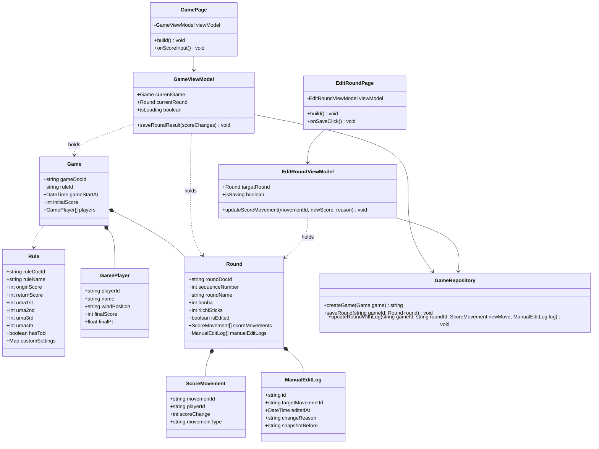

```mermaid
classDiagram
    direction TB

    class Rule {
        +string ruleDocId
        +string ruleName
        +int originScore
        +int returnScore
        +int uma1st
        +int uma2nd
        +int uma3rd
        +int uma4th
        +boolean hasTobi
        +Map customSettings
    }

    class Game {
        +string gameDocId
        +string ruleId
        +DateTime gameStartAt
        +int initialScore
        +GamePlayer[] players
    }

    class GamePlayer {
        +string playerId
        +string name
        +string windPosition
        +int finalScore
        +float finalPt
    }

    class Round {
        +string roundDocId
        +int sequenceNumber
        +string roundName
        +int honba
        +int riichiSticks
        +boolean isEdited
        +ScoreMovement[] scoreMovements
        +ManualEditLog[] manualEditLogs
    }

    class ScoreMovement {
        +string movementId
        +string playerId
        +int scoreChange
        +string movementType
    }

    class ManualEditLog {
        +string id
        +string targetMovementId
        +DateTime editedAt
        +string changeReason
        +string snapshotBefore
    }

    Game ..> Rule
    Game *-- GamePlayer
    Game *-- Round
    Round *-- ScoreMovement
    Round *-- ManualEditLog

    %% --------------------------------------------------
    %% 画面層（View）
    %% --------------------------------------------------
    class GamePage {
        -GameViewModel viewModel
        +build() void
        +onScoreInput() void
    }

    class EditRoundPage {
        -EditRoundViewModel viewModel
        +build() void
        +onSaveClick() void
    }

    %% --------------------------------------------------
    %% ロジック層（ViewModel）
    %% --------------------------------------------------
    class GameViewModel {
        +Game currentGame
        +Round currentRound
        +isLoading boolean
        +saveRoundResult(scoreChanges) void
    }

    class EditRoundViewModel {
        +Round targetRound
        +isSaving boolean
        +updateScoreMovement(movementId, newScore, reason) void
    }

    %% --------------------------------------------------
    %% データアクセス層（Repository / Firestore）
    %% --------------------------------------------------
    class GameRepository {
        +createGame(Game game) string
        +saveRound(string gameId, Round round) void
        +updateRoundWithLog(string gameId, string roundId, ScoreMovement newMove, ManualEditLog log) void
    }

    %% --------------------------------------------------
    %% 依存・利用関係（リレーション）
    %% --------------------------------------------------
    %% ViewはViewModelに依存（監視・操作）
    GamePage --> GameViewModel
    EditRoundPage --> EditRoundViewModel

    %% ViewModelはRepositoryを呼び出す
    GameViewModel --> GameRepository
    EditRoundViewModel --> GameRepository

    %% ViewModelはエンティティ（データ構造）を保持・操作する
    GameViewModel ..> Game : holds
    GameViewModel ..> Round : holds
    EditRoundViewModel ..> Round : holds
```