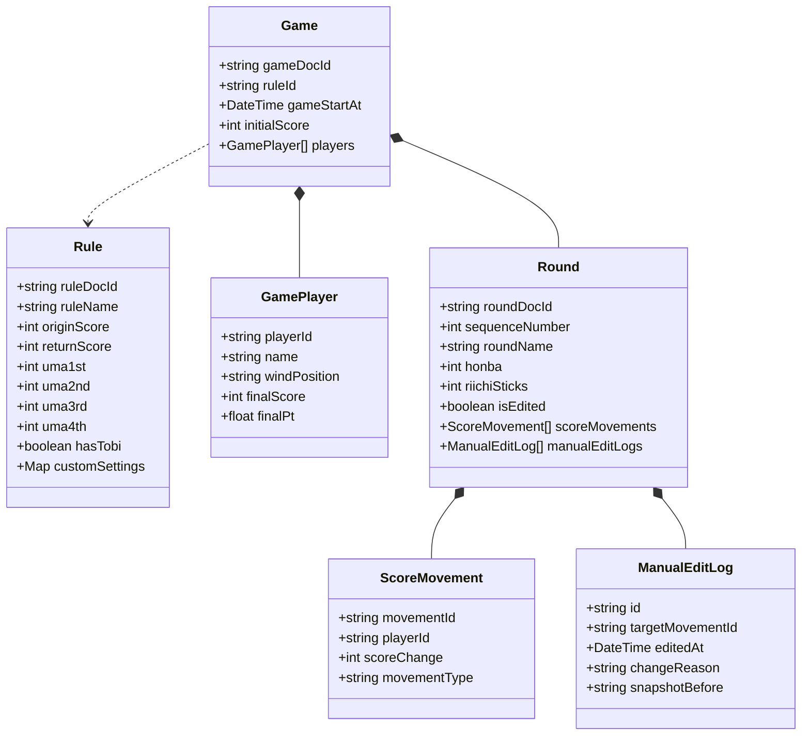

```mermaid
classDiagram
    direction TB

    class Rule {
        +string ruleDocId
        +string ruleName
        +int originScore
        +int returnScore
        +int uma1st
        +int uma2nd
        +int uma3rd
        +int uma4th
        +boolean hasTobi
        +Map customSettings
    }

    class Game {
        +string gameDocId
        +string ruleId
        +DateTime gameStartAt
        +int initialScore
        +GamePlayer[] players
    }

    class GamePlayer {
        +string playerId
        +string name
        +string windPosition
        +int finalScore
        +float finalPt
    }

    class Round {
        +string roundDocId
        +int sequenceNumber
        +string roundName
        +int honba
        +int riichiSticks
        +boolean isEdited
        +ScoreMovement[] scoreMovements
        +ManualEditLog[] manualEditLogs
    }

    class ScoreMovement {
        +string movementId
        +string playerId
        +int scoreChange
        +string movementType
    }

    class ManualEditLog {
        +string id
        +string targetMovementId
        +DateTime editedAt
        +string changeReason
        +string snapshotBefore
    }

    Game ..> Rule
    Game *-- GamePlayer
    Game *-- Round
    Round *-- ScoreMovement
    Round *-- ManualEditLog
```