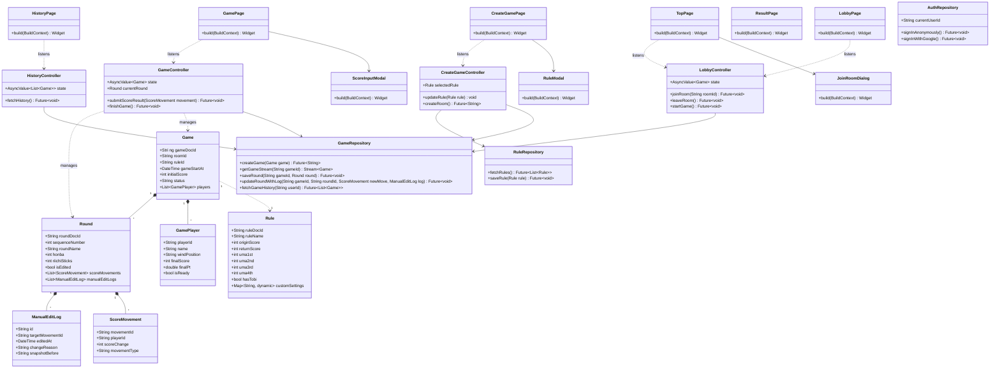

---
mermaid:
  panZoom: true
---

```mermaid

classDiagram
  direction TB

  %% --------------------------------------------------
  %% Domain / Data Models (Entities)
  %% --------------------------------------------------
  class Rule {
    +String ruleDocId
    +String ruleName
    +int originScore
    +int returnScore
    +int uma1st
    +int uma2nd
    +int uma3rd
    +int uma4th
    +bool hasTobi
    +Map~String, dynamic~ customSettings
  }

  class Game {
    +Stri ng gameDocId
    +String roomId
    +String ruleId
    +DateTime gameStartAt
    +int initialScore
    +String status
    +List~GamePlayer~ players
  }

  class GamePlayer {
    +String playerId
    +String name
    +String windPosition
    +int finalScore
    +double finalPt
    +bool isReady
  }

  class Round {
    +String roundDocId
    +int sequenceNumber
    +String roundName
    +int honba
    +int riichiSticks
    +bool isEdited
    +List~ScoreMovement~ scoreMovements
    +List~ManualEditLog~ manualEditLogs
  }

  class ScoreMovement {
    +String movementId
    +String playerId
    +int scoreChange
    +String movementType
  }

  class ManualEditLog {
    +String id
    +String targetMovementId
    +DateTime editedAt
    +String changeReason
    +String snapshotBefore
  }

  Game "1" ..> "1" Rule
  Game "1" *-- "*" GamePlayer
  Game "1" *-- "*" Round
  Round "1" *-- "*" ScoreMovement
  Round "1" *-- "*" ManualEditLog

  %% --------------------------------------------------
  %% Presentation Layer (Flutter Widgets / Views)
  %% --------------------------------------------------
  class TopPage {
    +build(BuildContext) Widget
  }

  class CreateGamePage {
    +build(BuildContext) Widget
  }

  class LobbyPage {
    +build(BuildContext) Widget
  }

  class GamePage {
    +build(BuildContext) Widget
  }

  class ResultPage {
    +build(BuildContext) Widget
  }

  class HistoryPage {
    +build(BuildContext) Widget
  }

  %% Dialogs / Modals
  class JoinRoomDialog {
    +build(BuildContext) Widget
  }

  class RuleModal {
    +build(BuildContext) Widget
  }

  class ScoreInputModal {
    +build(BuildContext) Widget
  }

  %% --------------------------------------------------
  %% Logic Layer (Riverpod Notifiers / ViewModels)
  %% --------------------------------------------------
  class LobbyController {
    +AsyncValue~Game~ state
    +joinRoom(String roomId) Future~void~
    +leaveRoom() Future~void~
    +startGame() Future~void~
  }

  class GameController {
    +AsyncValue~Game~ state
    +Round currentRound
    +submitScoreResult(ScoreMovement movement) Future~void~
    +finishGame() Future~void~
  }

  class CreateGameController {
    +Rule selectedRule
    +updateRule(Rule rule) void
    +createRoom() Future~String~
  }

  class HistoryController {
    +AsyncValue~List~Game~~ state
    +fetchHistory() Future~void~
  }

  %% --------------------------------------------------
  %% Data Access Layer (Repositories)
  %% --------------------------------------------------
  class GameRepository {
    +createGame(Game game) Future~String~
    +getGameStream(String gameId) Stream~Game~
    +saveRound(String gameId, Round round) Future~void~
    +updateRoundWithLog(String gameId, String roundId, ScoreMovement newMove, ManualEditLog log) Future~void~
    +fetchGameHistory(String userId) Future~List~Game~~
  }

  class RuleRepository {
    +fetchRules() Future~List~Rule~~
    +saveRule(Rule rule) Future~void~
  }

  class AuthRepository {
    +String currentUserId
    +signInAnonymously() Future~void~
    +signInWithGoogle() Future~void~
  }

  %% --------------------------------------------------
  %% Relationships
  %% --------------------------------------------------
  TopPage --> JoinRoomDialog
  CreateGamePage --> RuleModal
  GamePage --> ScoreInputModal

  TopPage ..> LobbyController : listens
  CreateGamePage ..> CreateGameController : listens
  LobbyPage ..> LobbyController : listens
  GamePage ..> GameController : listens
  HistoryPage ..> HistoryController : listens

  LobbyController --> GameRepository
  GameController --> GameRepository
  CreateGameController --> GameRepository
  CreateGameController --> RuleRepository
  HistoryController --> GameRepository

  GameController ..> Game : manages
  GameController ..> Round : manages
```