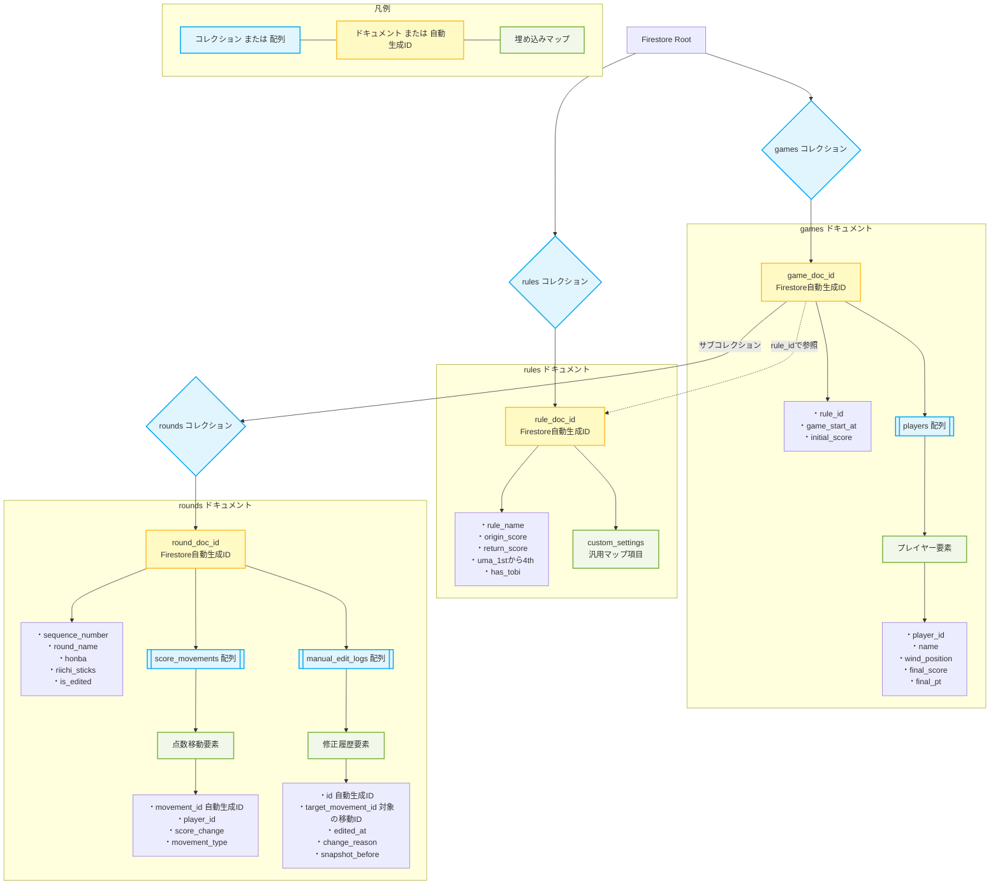

```mermaid
graph TD
    %% スタイル定義
    classDef collection fill:#e1f5fe,stroke:#03a9f4,stroke-width:2px;
    classDef document fill:#fff9c4,stroke:#fbc02d,stroke-width:2px;
    classDef object fill:#f1f8e9,stroke:#7cb342,stroke-width:2px;

    %% 凡例
    subgraph "凡例"
        direction LR
        L1[コレクション または 配列]:::collection --- L2[ドキュメント または 自動生成ID]:::document --- L3[埋め込みマップ]:::object
    end

    %% ルートコレクション
    Root[Firestore Root] --> rules_col{rules コレクション}:::collection
    Root --> games_col{games コレクション}:::collection

    %% rules コレクションの中身
    rules_col --> rule_doc[rule_doc_id <br> Firestore自動生成ID]:::document
    subgraph "rules ドキュメント"
        rule_doc --> r_fields[・rule_name<br>・origin_score<br>・return_score<br>・uma_1stから4th<br>・has_tobi]
        rule_doc --> r_custom[custom_settings <br> 汎用マップ項目]:::object
    end

    %% games コレクションの中身
    games_col --> game_doc[game_doc_id <br> Firestore自動生成ID]:::document
    subgraph "games ドキュメント"
        game_doc --> g_fields[・rule_id<br>・game_start_at<br>・initial_score]
        game_doc --> g_players[[players 配列]]:::collection
        g_players --> p_map[プレイヤー要素]:::object
        p_map --> p_fields[・player_id<br>・name<br>・wind_position<br>・final_score<br>・final_pt]
    end

    %% rounds サブコレクション
    game_doc -->|サブコレクション| rounds_col{rounds コレクション}:::collection
    rounds_col --> round_doc[round_doc_id <br> Firestore自動生成ID]:::document
    
    subgraph "rounds ドキュメント"
        round_doc --> rd_fields[・sequence_number<br>・round_name<br>・honba<br>・riichi_sticks<br>・is_edited]
        
        %% score_movementsの埋め込み（IDを追加）
        round_doc --> rd_move[[score_movements 配列]]:::collection
        rd_move --> m_map[点数移動要素]:::object
        m_map --> m_fields[・movement_id 自動生成ID<br>・player_id<br>・score_change<br>・movement_type]
        
        %% manual_edit_logsの埋め込み（対象IDを追加）
        round_doc --> rd_logs[[manual_edit_logs 配列]]:::collection
        rd_logs --> l_map[修正履歴要素]:::object
        l_map --> l_fields[・id 自動生成ID<br>・target_movement_id 対象の移動ID<br>・edited_at<br>・change_reason<br>・snapshot_before]
    end

    %% データの参照関係
    game_doc -.->|rule_idで参照| rule_doc
```