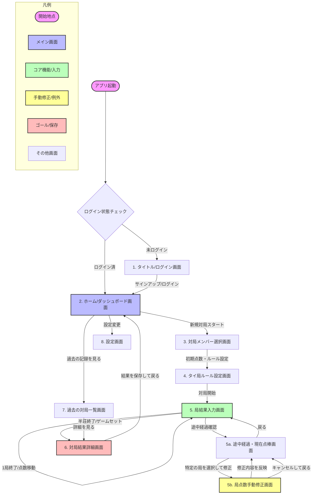

```mermaid
graph TD
    %% --------------------------------------------------
    %% 画面遷移の定義
    %% --------------------------------------------------
    Start([アプリ起動]) --> Login{ログイン状態チェック}
    
    Login -- 未ログイン --> Title[1. タイトル/ログイン画面]
    Login -- ログイン済 --> Home[2. ホーム/ダッシュボード画面]
    
    Title -->|サインアップ/ログイン| Home
    
    %% ホーム画面からの遷移
    Home -->|新規対局スタート| MemberSelect[3. 対局メンバー選択画面]
    Home -->|過去の記録を見る| HistoryList[7. 過去の対局一覧画面]
    Home -->|設定変更| Settings[8. 設定画面]
    
    %% 对局中の遷移
    MemberSelect -->|初期点数・ルール設定| GameConfig[4. タイ局ルール設定画面]
    GameConfig -->|対局開始| ScoreInput[5. 局結果入力画面]
    
    ScoreInput -->|1局終了/点数移動| ScoreInput
    ScoreInput -->|途中経過確認| InterimResult[5a. 途中経過・現在点棒画面]
    InterimResult -->|戻る| ScoreInput
    
    %% 手動修正画面への遷移
    InterimResult -->|特定の局を選択して修正| ManualEdit[5b. 局点数手動修正画面]
    ManualEdit -->|修正内容を反映| InterimResult
    ManualEdit -->|キャンセルして戻る| InterimResult
    
    %% 対局終了の遷移
    ScoreInput -->|半荘終了/ゲームセット| GameResult[6. 対局結果詳細画面]
    GameResult -->|結果を保存して戻る| Home
    
    %% 履歴からの遷移
    HistoryList -->|詳細を見る| GameResult
    
    %% --------------------------------------------------
    %% スタイル適用
    %% --------------------------------------------------
    style Start fill:#f9f,stroke:#333,stroke-width:2px
    style Home fill:#bbf,stroke:#333,stroke-width:2px
    style ScoreInput fill:#bfb,stroke:#333,stroke-width:2px
    style GameResult fill:#fbb,stroke:#333,stroke-width:2px
    style ManualEdit fill:#ff9,stroke:#333,stroke-width:2px
    
    style L_Start fill:#f9f,stroke:#333,stroke-width:2px
    style L_Home fill:#bbf,stroke:#333,stroke-width:2px
    style L_Core fill:#bfb,stroke:#333,stroke-width:2px
    style L_Edit fill:#ff9,stroke:#333,stroke-width:2px
    style L_End fill:#fbb,stroke:#333,stroke-width:2px

    %% --------------------------------------------------
    %% 凡例 (Legend) の定義（上部に配置）
    %% --------------------------------------------------
    subgraph 凡例
        direction LR
        L_Start([開始地点]) 
        L_Home[メイン画面]
        L_Core[コア機能/入力]
        L_Edit[手動修正/例外]
        L_End[ゴール/保存]
        L_Normal[その他画面]
    end

```